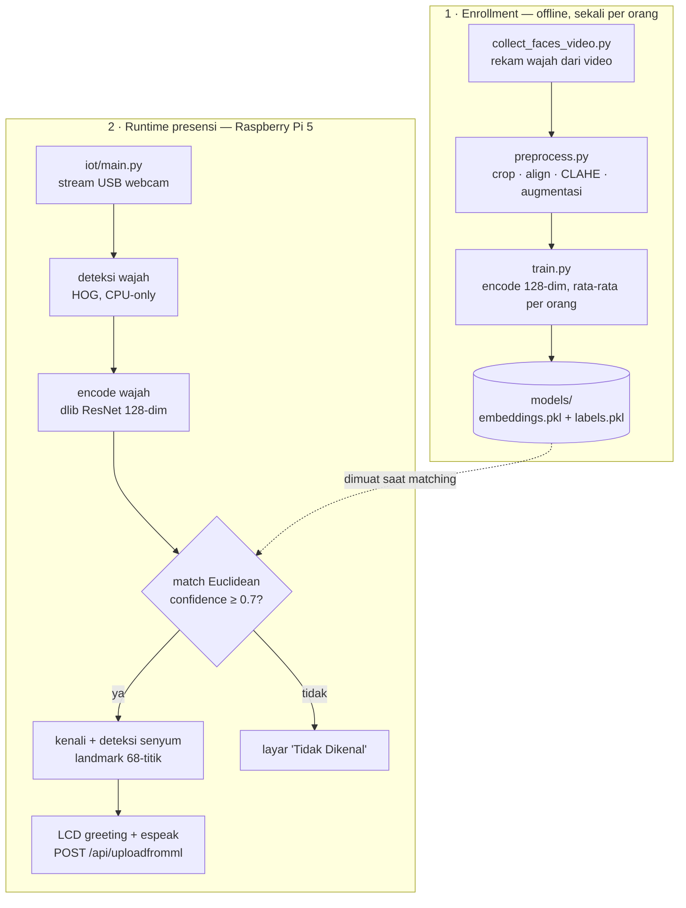

# Boostify — ML & IoT (Face Recognition Attendance)


Sistem presensi berbasis **pengenalan wajah** untuk lab (CPS Laboratory). Modul ML ini berjalan di **Raspberry Pi 5** dengan USB webcam, LCD SPI 3.5", dan speaker. Wajah yang dikenali otomatis tercatat ke backend, lengkap dengan deteksi senyum dan sapaan personal di LCD + suara.

> **Scope repo:** ini **khusus layer ML/IoT**. Backend (Node/Express) & frontend (Next.js) ada di repo terpisah. Modul ini hanya mengirim hasil presensi ke API backend.

---

## Daftar Isi

- [Fitur](#fitur)
- [Arsitektur & Pipeline](#arsitektur--pipeline)
- [Tech Stack](#tech-stack)
- [Struktur Folder](#struktur-folder)
- [Prasyarat](#prasyarat)
- [Instalasi](#instalasi)
- [Konfigurasi](#konfigurasi-configpy)
- [Cara Pakai](#cara-pakai)
- [Integrasi Backend](#integrasi-backend)
- [Crowd Prediction (opsional)](#crowd-prediction-opsional)
- [Catatan Platform](#catatan-platform-windows-vs-pi)
- [Troubleshooting](#troubleshooting)
- [Known Issues / WIP](#known-issues--wip)
- [Lisensi & Kontributor](#lisensi--kontributor)

---

## Fitur

- **Face recognition** pakai dlib ResNet (128-dim) lewat library `face_recognition`.
- **Deteksi senyum** berbasis landmark (rasio lebar mulut : lebar wajah) — tanpa model tambahan, tahan cahaya, kebaca senyum tertutup & terbuka.
- **CLAHE enhancement** biar stabil di kondisi cahaya kurang.
- **Anti-flicker senyum** lewat voting multi-frame.
- **Cooldown** per orang biar nggak dobel-absen.
- **LCD UI** (pygame, 480×320): standby, greeting personal, layar "tidak dikenal".
- **Suara** sapaan via `espeak` (pesan menyesuaikan waktu: Pagi/Siang/Sore/Malam).
- **Integrasi backend** otomatis (`POST /api/uploadfromml`).
- **Collect dataset dari video** (rekam orang noleh pelan, frame difilter otomatis).
- **Crowd prediction** (opsional): prediksi jam ramai/sepi lab via RandomForest.

---

## Arsitektur & Pipeline

Sistem terbagi dua tahap: **enrollment** (offline, dijalankan sekali per orang untuk membuat file model) dan **runtime presensi** (berjalan terus di Raspberry Pi). File `embeddings.pkl` yang dihasilkan saat enrollment dimuat dan dipakai saat matching.



Ringkasnya: **`collect → preprocess → train → run`**. Detail tiap langkah ada di [Cara Pakai](#cara-pakai).

---

## Tech Stack

| Komponen | Detail |
|----------|--------|
| Model recognition | dlib ResNet 128-dim (`face_recognition`) |
| Detektor wajah | HOG (CPU-only, ringan untuk Pi) |
| Matching | Euclidean distance — `confidence = 1 - distance` |
| Smile detection | 68-point landmark dlib, rasio mulut : wajah |
| Preprocessing | CLAHE + augmentasi |
| Display | pygame (LCD SPI `/dev/fb1`) |
| Audio | espeak |
| Bahasa | Python 3 |
| Hardware | Raspberry Pi 5 + USB webcam + LCD 3.5" + speaker |

---

## Struktur Folder

```
ml/
├── config.py                 # SEMUA parameter (threshold, path, kamera) di sini
├── collect_faces.py          # ambil dataset foto satu-satu (versi original)
├── collect_faces_video.py    # ambil dataset dari VIDEO (rekomendasi, lebih cepat)
├── preprocess.py             # crop/align wajah + CLAHE + augmentasi → dataset/processed
├── train.py                  # enrollment: bikin embeddings.pkl + labels.pkl
├── predict.py                # engine recognition (FaceRecognizer) + smile
├── evaluate.py               # evaluasi akurasi  ⚠️ WIP — lihat Known Issues
├── predict_crowd.py          # prediksi keramaian lab (opsional)
├── requirements.txt
├── dataset/
│   ├── raw/<nama>/           # foto/full-frame mentah hasil collect
│   ├── processed/<nama>/     # hasil preprocess (siap train)
│   └── test/<nama>/          # foto buat evaluate
├── models/
│   ├── embeddings.pkl        # dict {nama: mean_encoding_128d}
│   └── labels.pkl            # list nama terdaftar
├── logs/
│   └── boostify_ml.log
├── utils/
│   └── logger.py
└── iot/
    └── main.py               # ENTRY POINT di Pi (LCD + speaker + API)
```

---

## Prasyarat

| Komponen | Kebutuhan |
|----------|-----------|
| Python | 3.9+ |
| OS Pi | Raspberry Pi OS Bookworm 64-bit |
| Hardware | Pi 5, USB webcam, LCD SPI 3.5" (480×320), speaker |
| Dev (opsional) | Windows + webcam buat tes sebelum deploy |

---

## Instalasi

### Windows (development)

```powershell
python -m venv venv
venv\Scripts\activate
pip install -r requirements.txt
```

### Raspberry Pi 5 (deploy)

Pakai piwheels biar dlib nggak compile dari nol (lama banget kalau dari source):

```bash
python -m venv venv
source venv/bin/activate
pip install -r requirements.txt --extra-index-url https://www.piwheels.org/simple

# espeak untuk suara
sudo apt install espeak
```

> **Catatan dlib di Pi:** kalau piwheels nggak nyediain wheel yang cocok, dlib akan compile dari source dan butuh `cmake` + build tools. Pasang dulu:
> ```bash
> sudo apt install cmake build-essential
> ```

---

## Konfigurasi (`config.py`)

Semua nilai penting ada di satu file. Yang paling sering disentuh:

| Parameter | Default | Fungsi |
|-----------|---------|--------|
| `CAMERA_INDEX` | `1` | 0 = kamera default, 1 = USB eksternal |
| `SIMILARITY_THRESHOLD` | `0.7` | `confidence ≥ 0.7` → dikenali (lihat catatan di bawah) |
| `FR_DETECTOR` | `"hog"` | `hog` (ringan, CPU) atau `cnn` (akurat, butuh GPU) |
| `FR_NUM_JITTERS` | `1` | 1 = cepat; 10 = paling akurat tapi lambat |
| `DETECT_SCALE` | `0.5` | deteksi di frame 50% → HOG lebih ngebut di Pi |
| `FRAME_SKIP` | `8` | proses 1 dari tiap N frame (hemat CPU) |
| `COOLDOWN_SEC` | `60` | jeda detik setelah absen sukses |
| `MIN_PHOTOS_PER_PERSON` | `50` | minimal foto per orang |
| `AUGMENT_PER_IMAGE` | `15` | 50 foto × 15 = 750 data per orang |
| `CLAHE_CLIP` | `3.0` | makin besar = kontras makin kuat |
| `SMILE_RATIO_THRESHOLD` | `0.42` | threshold rasio senyum (di `predict.py`) |

### Cara kerja threshold (PENTING)

Matching pakai **Euclidean distance** dlib, lalu dikonversi:

```
confidence = max(0, 1 - distance)
```

| Distance | Confidence | Arti |
|----------|------------|------|
| `0.0` | `1.0` | identik |
| `0.3` | `0.7` | batas dikenali saat ini |
| `0.6` | `0.4` | toleransi default dlib |
| `1.0+` | `0.0` | beda orang |

Dengan `SIMILARITY_THRESHOLD = 0.7`, wajah baru dianggap dikenali kalau **distance ≤ 0.3** — ini cukup **ketat**. Kalau banyak wajah valid malah jadi "Unknown", turunkan threshold (mis. `0.4`–`0.5`). Kalau ada salah-orang (cross-match), naikkan.

> **Akar masalah** ketidakstabilan biasanya **kualitas data (pencahayaan saat collect)**, bukan threshold. Re-record di cahaya bagus lebih ampuh daripada nurunin threshold, karena nurunin threshold rawan bikin salah-kenal antar orang.

---

## Cara Pakai

Urutan pipeline: **collect → preprocess → train → run**.

### 1. Collect dataset (dari video — rekomendasi)

Rekam orang noleh pelan kiri/kanan/atas/bawah (mirip daftar Face ID), script ambil frame yang bersih (buang blur, wajib 1 wajah, buang frame mirip).

```bash
# dari file video
python collect_faces_video.py --nama "DAFFAFR" --video rekaman.mp4

# rekam langsung dari webcam (di Pi WAJIB --headless, LCD-nya hitam)
python collect_faces_video.py --nama "DAFFAFR" --record --durasi 6 --headless

# langsung sampai siap dikenali (collect → preprocess → register)
python collect_faces_video.py --nama "DAFFAFR" --video rekaman.mp4 --auto

# sekalian jalanin presensi setelah selesai
python collect_faces_video.py --nama "DAFFAFR" --video rekaman.mp4 --auto --run iot/main.py
```

Opsi filter dataset:

| Flag | Default | Fungsi |
|------|---------|--------|
| `--skip` | `5` | ambil 1 dari tiap N frame |
| `--blur` | `60.0` | buang frame goyang (makin tinggi makin ketat) |
| `--max` | `60` | batas jumlah foto disimpan |
| `--diversity` | `0.35` | buang frame mirip (makin kecil makin variatif) |

### 2. Preprocess

```bash
python preprocess.py
```

Crop/align wajah dari `dataset/raw/` → `dataset/processed/`, plus CLAHE & augmentasi. (Dipanggil otomatis kalau pakai `--auto` di langkah collect.)

### 3. Train / Enrollment

```bash
# train ulang semua orang
python train.py

# tambah 1 orang baru tanpa retrain semua (lebih cepat)
python train.py --register "DAFFAFR"
```

> `train.py` itu **enrollment**, bukan training model dari nol. Dia pakai dlib ResNet yang sudah pretrained, lalu rata-ratakan encoding tiap orang jadi 1 representasi. `--register` dengan nama yang **sudah ada akan menimpa**, bukan menambah.

### 4. Jalankan presensi (di Pi)

```bash
python iot/main.py
```

Yang terjadi: kamera nyala → standby di LCD → begitu wajah dikenali → LCD nampilin sapaan + confidence, speaker bunyi, data dikirim ke backend. Kalau nggak dikenali → layar "Tidak Dikenal".

### Tes cepat tanpa LCD (Windows/dev)

```bash
python predict.py
```

Mode ini buka jendela OpenCV (bukan LCD), nampilin nama + confidence + rasio senyum buat kalibrasi. Berguna buat ngepas-in `SMILE_RATIO_THRESHOLD` dan threshold.

---

## Integrasi Backend

Hasil presensi dikirim sebagai JSON ke:

```
POST {API_URL}/api/uploadfromml      # tanpa auth
```

`API_URL` di-set di `iot/main.py` (default: deployment Vercel). Payload:

```json
{
  "status": "recognized",
  "assisstant_code": "FDL",
  "name": "DAFFAFR",
  "confidence": 0.82,
  "time": "2026-06-24T08:30:00+00:00",
  "uuid": "…",
  "formattedTime": "Tuesday, June 24, 2026",
  "is_smiling": true,
  "message": "Selamat Datang, DAFFAFR!"
}
```

> ⚠️ Field bernama `assisstant_code` (ada **typo double-s** yang ngikut skema backend — **jangan diperbaiki sepihak**, nanti mismatch sama DB). Tipe `VARCHAR(3)`.

### Kode asisten per orang

Diatur manual di `predict.py` → dict `KODE_ASISTEN`:

```python
KODE_ASISTEN = {
    "daffa"   : "FDR",
    "dirgi"   : "DRG",
    "DAFFAFR" : "FDL",
    # "nama"  : "KODE",
}
```

Kalau nama nggak ada di map, fallback ke 3 huruf pertama (uppercase).

---

## Crowd Prediction (opsional)

`predict_crowd.py` baca tabel `Attendance`, latih RandomForest per `(hari, jam)`, lalu klasifikasi tiap slot jadi **ramai / sedang / sepi**, simpan ke tabel `Prediction`.

```bash
# butuh DIRECT_URL atau DATABASE_URL di .env
python predict_crowd.py
```

Jam operasional default `7–19` (atur di konstanta `OPEN_HOUR` / `CLOSE_HOUR`). Idealnya dijadwalkan (cron) buat precompute berkala.

---

## Catatan Platform (Windows vs Pi)

- **Backend kamera:** Windows pakai `cv2.CAP_DSHOW`, Linux/Pi pakai `cv2.CAP_V4L2`. `predict.py` & `collect_faces_video.py` sudah auto-pilih sesuai OS — jangan hardcode DSHOW di Linux (bakal gagal buka kamera).
- **LCD SPI:** `cv2.imshow` ke LCD SPI hasilnya **hitam**. Tampilan di Pi dirender via **pygame** (`iot/main.py`). Untuk lihat preview OpenCV, pakai HDMI.
- **Headless di Pi:** saat collect via webcam di Pi, tambahkan `--headless` (nggak ada preview window).
- **Workflow deploy:** develop & tes di Windows → `scp` ke Pi → jalankan di Pi.

---

## Troubleshooting

| Masalah | Solusi |
|---------|--------|
| `FileNotFoundError: Jalankan train.py dulu` | `embeddings.pkl` belum ada — jalankan `python train.py` |
| Kamera hitam / gagal buka di Pi | cek `CAMERA_INDEX`, pastikan pakai V4L2 (bukan DSHOW) |
| Wajah valid jadi "Unknown" terus | turunkan `SIMILARITY_THRESHOLD`, atau re-collect di cahaya lebih baik |
| Salah-kenal antar orang | naikkan `SIMILARITY_THRESHOLD`, tambah variasi dataset |
| Senyum nggak kedeteksi / false positive | kalibrasi `SMILE_RATIO_THRESHOLD` lewat `python predict.py` (lihat angka ratio) |
| dlib lama banget install di Pi | pakai `--extra-index-url https://www.piwheels.org/simple` |
| LCD nampilin hitam | pakai pygame (`iot/main.py`), bukan `cv2.imshow` |
| Suara nggak keluar | pastikan `espeak` terpasang (`sudo apt install espeak`) |
| Crowd prediction error koneksi DB | set `DIRECT_URL` / `DATABASE_URL` di `.env`; cek Supabase nggak ke-pause |

---

## Known Issues / WIP

- **`evaluate.py` belum kompatibel.** Script ini masih ekstrak embedding pakai **DeepFace** (`represent` + cosine similarity), padahal `embeddings.pkl` dibikin pakai **dlib** (Euclidean). Dua ruang vektor yang beda, jadi hasil evaluasinya **tidak valid** untuk pipeline saat ini. Perlu di-port ke `face_recognition` (dlib) + Euclidean distance dulu sebelum dipakai.
- **Tabel `Prediction` di Supabase.** Fitur crowd prediction butuh tabel `Prediction`, tapi tabel ini pernah hilang di Supabase meski skema terlihat sinkron — pastikan model `Prediction` benar-benar ada di `schema.prisma` backend dan ter-migrate.
- **Komentar threshold di `config.py` nggak sinkron** dengan nilai aktualnya (`0.7`). Acuan yang benar adalah perilaku kode (lihat bagian [Cara kerja threshold](#cara-kerja-threshold-penting)).

---

## Lisensi & Kontributor

Project lab **CPS Laboratory**. Modul ML/IoT: **Dappa** (Muhammad Daffa Fadlurrahman).